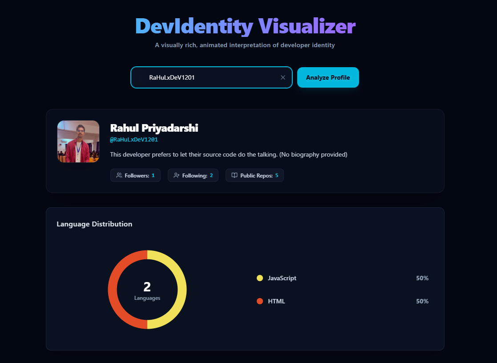

# DevIdentity Visualizer

> A visually rich, animated interpretation of developer identity powered by the GitHub REST API.

[](https://github-visualizer-eta.vercel.app)
[](https://drive.google.com/file/d/1Hu2x4kb5dma4ShRwSXhbtwtHuGhP8gf7/view?usp=drive_link)


## Overview

DevIdentity Visualizer is not just another GitHub clone...



It is a creative, polished dashboard designed to transform raw GitHub data into an engaging visual experience. Built as part of a frontend challenge, this project prioritizes smooth animations, resilient API handling, and custom-built data visualization without relying on heavy third-party charting libraries.

## Core Features

*   **Custom Data Visualization:** Features a **100% hand-built SVG radial donut chart** to display language distribution. It includes interactive hover states, dynamic center text, and custom mathematical calculations for the `stroke-dasharray`—no Chart.js or Recharts used here.
*   **Comprehensive Profile Identity:** Displays user avatars, names, biographies, follower/following counts, and repository metrics in a clean, glassmorphism-inspired UI.
*   **Top Performance Metrics:** Renders top repositories as interactive cards detailing primary languages, star counts, fork counts, and descriptions.
*   **Fluid Animations:** Utilizes Framer Motion for smooth state transitions (Loading → Loaded, Error states) and micro-interactions, ensuring the UI never feels rigid or hard-cut.
*   **Responsive & Intentional Design:** Built with Tailwind CSS, the dashboard adapts seamlessly to all screen sizes while maintaining a strict, visually striking dark theme.

## 📁 Project Structure

```text
github-visualizer/
├── public/              # Static assets & preview images
├── src/
│   ├── components/      # UI components (Cards, Search, Charts)
│   ├── hooks/           # Custom hooks for GitHub API fetching
│   ├── utils/           # SVG math calculations
│   ├── App.jsx          # Root application component
│   └── main.jsx         # Vite entry point
├── .env.example         # Template for environment variables
└── README.md
```

## API Resilience & Edge Case Handling
This application is designed to be highly fault-tolerant against the realities of the GitHub REST API:

*   **Rate Limit Detection:** Gracefully catches 403 errors and explicitly warns the user if the unauthenticated rate limit (60 requests/hr) is exceeded, rather than crashing.
*   **Missing Users (404):** Displays a friendly UI prompt if a searched developer identity does not exist.
*   **Zero-Repository Users:** Implements a specific fallback UI for developers who have accounts but no public repositories to visualize.
*   **Empty Bio Fallbacks:** Injects default messaging when a user prefers to leave their GitHub bio blank ("This developer prefers to let their source code do the talking").

## 🔑 Environment Variables & Rate Limits

By default, the app uses unauthenticated GitHub REST API calls (limited to 60 requests/hour per IP). To expand this limit to 5,000 requests/hour:

1. Create a `.env` file in the root directory.
2. Add your GitHub Personal Access Token:
   ```env
   VITE_GITHUB_TOKEN=your_token_here

## Tech Stack

*   **Framework:** React.js (via Vite)
*   **Styling:** Tailwind CSS
*   **Animations:** Framer Motion
*   **Icons:** Lucide React
*   **Data Source:** GitHub REST API (`/users/{RaHuLxDeV1201}` & `/users/{RaHuLxDeV1201}/github-visualizer`)

## Getting Started (Local Development)

To run this project locally on your machine:

```bash
# 1. Clone the repository
git clone https://github.com/RaHuLxDeV1201/github-visualizer.git 

# 2. Navigate into the directory
cd github-visualizer

# 3. Install dependencies
npm install

# 4. Start the development server
npm run dev
